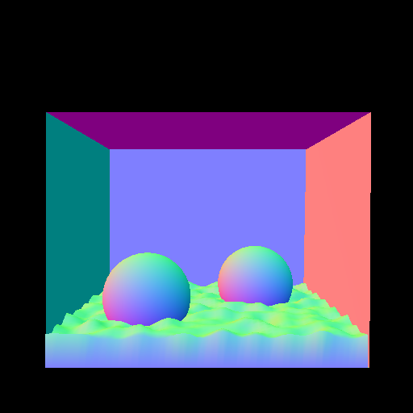

# embree-tinyobj-example

minimal raytracing example with a combination of embree and tinyobjloader



## Requirements

* CMake (>=3.20)
* [Embree3](https://github.com/embree/embree)
* OpenMP (Optional)

## Build

```
git submodule update --init
mkdir build
cd build
cmake ..
make
```

## Run

Download `.obj` from (McGuire Computer Graphics Archive)[http://casual-effects.com/data/)] and run `examples/main.cpp`

## Structure

|Name|Description|
|:--|:--|
|`camera.h`|ray generation from camera|
|`core.h`|basic types|
|`image.h`|image|
|`material.h`|material|
|`scene.h`|holding mesh data, ray-scene intersection, loading model|

## Externals

* [tinyobjloader](https://github.com/tinyobjloader/tinyobjloader)